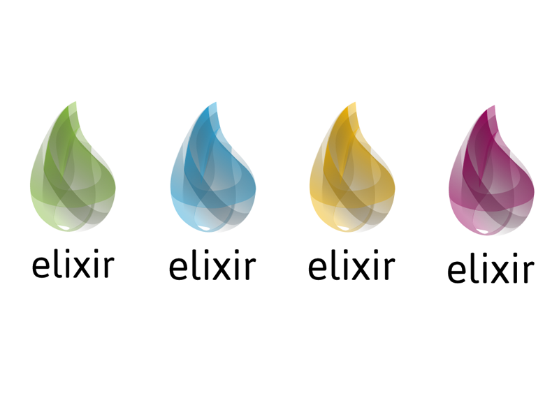

#HSLIDE
## Конкурентно програмиране I


#HSLIDE
## Съдържание

1. Elixir като конкурентно-ориентиран език
2. Абстракцията `Task`
3. Абстракцията `Agent`

#HSLIDE
## Elixir като конкурентно-ориентиран език


#HSLIDE
### Във всеки процес

* В един процес кодът се изпълнява последователно.
* Изразното средство е функционален език.
* Данните са непроменими.

#HSLIDE
### Node - множество процеси

* Когато пуснем Elixir, обикновено имаме множество такива процеси.
* Те си комуникират с размяна на съобщения.
* Всеки от тях има роля или множество роли.
* Ако ги разглеждаме като конструкции в езика, отвън изглеждат променими.
* Ще разгледаме тези процеси в две интересни роли.

#HSLIDE
## Задачи


#HSLIDE
Най-лесният начин да изпълним нещо конкуентно на текущата ни логика е с `Task`:

```elixir
task = Task.async(fn -> 1 + 1 end)
#=> %Task{
#=>   owner: #PID<0.89.0>,
#=>   pid: #PID<0.273.0>,
#=>   ref: #Reference<0.999173714.2842427393.228068>
#=> }
```

#HSLIDE
Функция `Task.async/1` връща структура, която представлява задачата.
Трите ѝ полета са:
* `owner`, който е *pid*-а на текущия процес.
* `pid`, който е адреаса (*pid*-a) на задачата.
* `ref` е специална и уникална стойност.

#HSLIDE
Можем да използваме тази структура за да прочетем резултата от изпълнението на задачата:

```elixir
task = Task.async(fn -> 1 + 1 end)
#=> %Task{...}

# Друга логика може да се изпълни тук...

# Когато сме готови:

result = Task.await(task)
# => 2
```

#HSLIDE
### async и await

* Функцията `Task.async/1` всъщност създава нов Elixir-ски процес.
* Този процес е специализиран да изпълни едно основно действие и да върне резултата от него.
* Функцията `Task.await/2` ще блокира текущия процес докато задачата завърши и резултата е наличен.
* Ако резултатът е наличен, когато я извикаме, направо ще го върне.

#HSLIDE
Какво ще стане, ако задачата отнеме твърде много време?

```elixir
task = Task.async(fn ->
  Process.sleep(10_000) # Симулираме дълга задача

  1 + 2
end)

result = Task.await(task)
#=> ** (exit) exited in: Task.await(%Task{...}, 5000)
#=>     ** (EXIT) time out
```

#HSLIDE
* Вторият параметър на `Task.await/2` е `timeout` (**5_000** по подразбиране).
* Ако изиваме `await` и това време изтече - грешка.

#HSLIDE
Пример: await с timeout

```elixir
task = Task.async(fn ->
  Process.sleep(10_000) # Симулираме дълга задача

  1 + 2
end)

result = Task.await(task, 11_000) # Ще почакаме около 10 секунди
#=> 3
```

#HSLIDE
Какво ще стане ако извикаме `await` повторно, след като вече имаме резултат?

```elixir
task = Task.async(fn -> 2 + 2 end)
result = Task.await(task)
# => 4

result = Task.await(task)
#=> ** (exit) exited in: Task.await(%Task{...}, 5000)
#=>     ** (EXIT) time out
```

#HSLIDE
1. Повторното извикване ще блокира и ще чака резултат
2. Тъй като задачата вече не съществува, няма да има нов резултат.
3. След пет секунди ще има *timeout* грешка.

Изводът е, че едно извикване на `async` трябва да съответства на точно едно извикване на `await`!

#HSLIDE
Функцията `Task.async/1` има и *MFA* версия - `Task.async/3`.

```elixir
task = Task.async(Kernel, :+, [2, 3])
#=> %Task{...}

result = Task.await(task)
#=> 5
```

#HSLIDE
#### Parallel map - повторение

```elixir
defmodule TaskEnum do
  def map(enumerable, fun) do
    enumerable
    |> Enum.map(& Task.async(fn -> fun.(&1) end))
    |> Enum.map(& Task.await(&1))
  end
end
```

#HSLIDE
### Проверка за резултат на даден интервал


#HSLIDE
* Абстракцията `Task` може да се ползва като *future* стойностите от други езици и системи.
* За тази цел, бихме могли да полваме функцията `Task.yield/2`.
* Подобно на `Task.await/2`, `yield` блокира текущия процес за дадено време, но ако няма резултат връща `nil`.

#HSLIDE
```elixir
task = Task.async(fn -> Process.sleep(5_000); 3 + 3 end)
#=> %Task{...}

Task.yield(task, 1_000)
#=> nil

Task.yield(task, 2_000)
#=> nil

{:ok, 6} = Task.yield(task, 3_000)
#=> {:ok, 6}
```

#HSLIDE
* Изглежда, че *poll*-ваме задачата за резултат, но не е така.
* Процесите в Elixir комуникират помежду си чрез размяна на съобщения, което прилича на изпращане на *push нотификации*.
* Когато задачата си свърши работата, резултатът ще бъде **изпратен** до текущия процес.
* Само процесът `onwer` на задачата може да извика `Task.await/2` или `Task.yield/2`.

#HSLIDE
```elixir
task1 = Task.async(fn -> 4 + 3 end)
#=> %Task{owner: #PID<0.10199.0>, ...}

Task.async(fn -> Task.yield(task1) end)
#=> ** (EXIT from #PID<0.10199.0>) process exited with reason:
#=>     ** (ArgumentError) task %Task{owner: #PID<0.10199.0>, ...}
#=>       must be queried from the owner
#=>       but was queried from #PID<0.10205.0>
```

#HSLIDE
* При успех `yield` връща `{:ok, result}`.
* Ако все още няма резултат, връща `nil`.
* Друго нещо, което може да върне е `{:exit, reason}`, ако задачата завърши без резултат:

```elixir
defmodule Calc do
  def sum(a, b) when is_number(a) and is_number(b), do: a + b
  def sum(_, _), do: Kernel.exit(:normal)
end
```

#HSLIDE
```elixir
task = Task.async(Calc, :sum, [4, 4])
#=> %Task{...}

{:ok, 8} = Task.yield(task)
#=> {:ok, 8}

task = Task.async(Calc, :sum, ["5", 4])
#=> %Task{...}

{:exit, :normal} = Task.yield(task)
#=> {:exit, normal}
```

#HSLIDE
### Освобождаване на задача

```elixir
task = Task.async(fn -> Process.sleep(10_000) end)

case Task.yield(task) || Task.shutdown(task) do
  {:ok, result} -> result
  nil -> {:error, "Task took too much time!"}
end
#=> {:error, "Task took too much time!"}

Process.alive?(task.pid)
#=> false
```

#HSLIDE
### Фукнцията Task.async_stream/3


#HSLIDE
* Приема колекция и функция, която да изпълни на всеки елемент на колекцията.
* Подадената функция се изпълнява в различен `Task` за всеки елемент.
* Когато опитаме да консумираме този *stream*, всяка задача ще бъде изчакана дадено време.

#HSLIDE
```elixir
defmodule TaskEnum do
  def map(enumerable, fun) do
    enumerable
    |> Task.async_stream(fun)
    |> Stream.map(fn {:ok, val} -> val end)
    |> Enum.to_list()
  end
end
```

#HSLIDE
### Пример Github


#HSLIDE
## Агенти


#HSLIDE
* Подобно на `Task`, `Agent` е абстракция над Elixir-ски процес.
* Агентът представлява състояние, което е съхранено в отделен процес.
* То е достъпно от други процеси или от един и същ процес на различни етапи от изпълнението му.

#HSLIDE
### SIDE EFFECTS


#HSLIDE
### Агентът като стойност

```elixir
{:ok, agent} = Agent.start(fn -> 1 end)
#=> {:ok, #PID<0.187.0>}

Agent.get(agent, fn v -> v end)
#=> 1

Agent.update(agent, fn v -> v + 1 end)
#=> :ok

Agent.get(agent, fn v -> v end)
#=> 2
```

#HSLIDE
### Агентът като споделена стойност

```elixir
defmodule DependentTask do
  def execute(agent) when is_pid(agent) do
    agent |> Agent.get(&(&1)) |> run(agent)
  end

  defp run(n, agent) when n < 5, do: execute(agent)
  defp run(n, _), do: n * n
end
```

#HSLIDE
Стойността е достъпна от множество процеси!
```elixir
{:ok, agent} = Agent.start(fn -> 1 end)
task = Task.async(DependentTask, :execute, [agent])

nil = Task.yield(task, 100)
nil = Task.yield(task, 1000)

:ok = Agent.update(agent, fn _ -> 10 end)
{:ok, val} = Task.yield(task, 100)
#=> {:ok, 100}
```

#HSLIDE
* Задачата и текущия процес имат достъп до една и съща стойност от трети процес - агента.
* Задачата по дефиниция зависи от стойността в агента.
* На практика можем да направим и пуснем друга задача, имаща достъп до адреса на агента, която може да промени тази стойност
* По такъв начин получаваме нещо като споделено състояние.

#HSLIDE
* Разликата е, че до това състояние е винаги *immutable*.
* Съобщенията които постъпват в процеса-агент се усвояват в реда в който са дошли.
* Възможно е да счупим нещата, но ако използваме правилно интерфейса на агента това няма да стане.

#HSLIDE


#HSLIDE
Възможно е да имаме *race conditions*.

```elixir
defmodule Value do
  def init(v) do
    {:ok, value} = Agent.start(fn -> v end)
    value
  end

  def get(value), do: Agent.get(value, &(&1))
  def set(value, v), do: Agent.update(value, fn _ -> v end)
end
```

#HSLIDE
Възможно е да имаме *race conditions*.

```elixir
value = Value.init(5)
action = fn ->
  Process.sleep(50)
  v = Value.get(value)
  :ok = Value.set(value, v * 2)
end

{:ok, _} = Task.start(action)
{:ok, _} = Task.start(action)
{:ok, _} = Task.start(action)
{:ok, _} = Task.start(action)

Process.sleep(200)
Value.get(value)
```

#HSLIDE
### Функциите на Agent
* Агентът има `get`, `update` и атомарната `get_and_update` функции.
* С първите две дадохме примери.
* С третата можем да оправим предния пример!


#HSLIDE
### Функциите на Agent
* Видяхме, че `Agent` има функция за стартиране, на която се подава фунцкия, връщаша състоянието на агента.
* Има и `MFA` версия на `start`, както и `start_link` версии.
* Версиите с *link* биха убили процеса на агента, ако този, който го е пуснал вече не съществува и обратно.

#HSLIDE
Защо всичко се изпълнява във функция?


#HSLIDE
* Тези функции, подавани на функциите на модула `Agent` се изпълняват в процеса-агент.
* Tрябва да бъдат кратки, за да не взимат много от времето на процеса.
* Промяната на състоянието на даден процес би трябвало да става в самия процес.
* Именно затова промяната и инициализирането на състоянието на `Agent`-а става във функции, които се ипълняват в процеса му.

#HSLIDE
* Можем да мислим за `Agent`-а и като за сървър.
* Процесите, които го ползват са клиенти, които комуникират с този сървър.
* Агентът трябва да е много прост сървър, неговата роля е просто да съхранява състояние.
* Това състояние може да бъде инициализирано, четено и променяно.
* Тежки изчисления, свързани със състоянието на агента не са част от неговата роля.

#HSLIDE
### Функциите на Agent
* Повечете са синхронни - чакаме за отговор.
* Състоянието на агент може да се променя и асинхронно - функцията `cast`.

#HSLIDE
### Пример Github


#HSLIDE
* В реалния живот за *cache* няма да ползвате агенти, защото има по-добри инструменти за това.
* За тестване и междинна работа агентите са добър избор.

#HSLIDE
## Край

